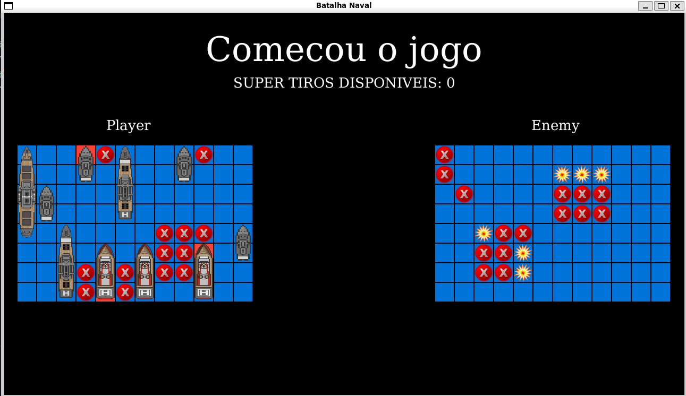

<h1 align="center">BattleShip Game</h1>

## 🔖Preview
<div align="center">
	
</div>
  
## 📜 About
Game project simulating the BattleShip game. The game was developed in ruby, using the ruby2d library. This project is entirely academic in nature, it was developed as a college project.

## 🚀 Technologies
- Ruby
- Ruby2d
- SQLite3

## 🎮 Controllers

### Board size selection screen

- *W* - move up
- *S* - move down
- *ENTER* - select

### Ships positions selection screen

- *W* - move up
- *S* - move down
- *A* - move left
- *D* - move right
- *CTRL* - rotate ship
- *ENTER* - select position

### Game screen

- *Left Mouse Click* - select board block
- *CTRL* - Enable/Disable super_shot mode

## 💻 Start the project locally

### Requirements

- Install Ruby
- Install dependencies (ruby2d and sqlite3)

**Clone this project and access the directory**

```bash
$ git clone https://github.com/andreydantasvf/BattleShip_Ruby && cd BattleShip_Ruby
```

**To start the game:**
```bash
$ ruby game/app.rb
```